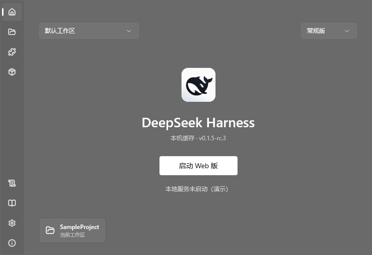

<div align="center">
  
  <h1>AnotherDSHL</h1>
  <p>Yet Another DeepSeek Harness Launcher</p>
  <p>使用 WinUI 3 构建的 Windows DeepSeek Harness 启动器</p>
  <p>
    <a href="https://github.com/zzbuaoye-love/Another-DeepSeek-Harness-Launcher/releases">下载发布版</a> ·
    <a href="#功能">功能</a> ·
    <a href="#构建">构建</a> ·
    <a href="https://github.com/zzbuaoye-love/Another-DeepSeek-Harness-Launcher/issues">反馈问题</a>
  </p>
</div>

<p align="center">
  
</p>

## 下载与使用

支持 **Windows 10 19041+ / Windows 11，x64**。发布版自带应用运行时，无需另装 .NET 或 MSIX。

| 版本 | 使用方式 |
| --- | --- |
| [安装版 Setup](https://github.com/zzbuaoye-love/Another-DeepSeek-Harness-Launcher/releases/download/v0.0.2-beta/AnotherDSHL-v0.0.2-beta-win-x64-Setup.exe) | 选择安装位置，可创建快捷方式，支持更新和卸载 |
| [便携版 ZIP](https://github.com/zzbuaoye-love/Another-DeepSeek-Harness-Launcher/releases/download/v0.0.2-beta/AnotherDSHL-v0.0.2-beta-win-x64-Portable.zip) | 解压后运行 `AnotherDSHL.exe` |

1. **常规版**：在“工作区”选择目录并配置 Node.js，再从首页启动 Web 服务。
2. **桌面版**：首页右上角切换启动方式，按提示安装或启动官方 DSH 客户端。
3. **整合包**：在侧栏浏览市场，下载并安装后，从首页左上角选择实例启动。

Web 启动和整合包操作需要 **Node.js 22.19+ 或 24+**；普通插件安装还需 pnpm。整合包安装会在缺少可用 pnpm 时准备实例专用版本。首次获取 DSH、插件和依赖需要联网，API 密钥在 DSH 自身界面中配置。

## 功能

| 模块 | 支持内容 |
| --- | --- |
| 启动与环境 | Web 服务启停、运行状态识别、工作目录、Node.js 选择、DSH 版本锁定和自定义端口 |
| 桌面客户端 | 官方客户端检测、下载安装、签名校验、启动与手动选择程序 |
| 插件 | 官方与社区目录、搜索与筛选、详情、安装、已安装列表和自定义目录源 |
| 整合包 | 市场浏览、本地导入、安装预览、取消安装、独立实例启动和 Profile 导出 |
| 安装与更新 | WinUI 安装器、下载校验、取消、稍后安装、本地差分包和失败回滚 |
| 界面 | 原生侧栏、Mica / Acrylic 材质、运行日志、内嵌文档与离线演示 |

### 整合包

内置 PackForge 核心引擎，外部管理器可选。每次安装创建独立的 DSH 运行时与 Profile；安装失败或取消时清理临时内容，保留下载缓存。切换启动实例前需停止当前服务。

支持 `.dspack` v2 / v3 的 Profile 与 DSH_HOME 包；暂不支持旧 `.tgz` 和 vendored 离线依赖扩展。详见 [引擎说明](packforge/README.md)及 [PackForge 格式规范](https://github.com/DSH-PackForge/DSH-PackForge)。

### 更新

在“关于 → 启动器更新”检查版本，可选择是否包含测试版。已校验的下载可稍后安装，重启后仍可继续；安装版优先使用基础版本匹配的差分包，否则使用完整 Setup。

首版 `v0.0.1-beta` ZIP 用户请使用完整安装包升级。更新保留设置和工作区，详见 [安装与更新说明](installer/README.md)。

## 构建

需要 Windows、.NET 8 SDK，以及可访问 NuGet 的网络环境。

```powershell
dotnet build AnotherDSHL.csproj -c Debug -p:Platform=x64 -r win-x64
& ".\bin\x64\Debug\net8.0-windows10.0.26100.0\win-x64\AnotherDSHL.exe"
```

安装包构建另需 PowerShell 7 和 Visual Studio C++ Build Tools（含 Windows SDK）：

```powershell
pwsh -File installer/scripts/Build-Installer.ps1
```

开发文档：[安装器与更新测试](installer/README.md) · [整合包引擎与测试](packforge/README.md)

<details>
<summary>进阶：自定义插件目录与演示模式</summary>

### 自定义插件目录

在插件页设置 HTTPS JSON 目录源，格式示例：

```json
{
  "plugins": [
    {
      "name": "示例插件",
      "owner": "author",
      "description": "功能说明",
      "installSpec": "@author/dsh-example",
      "url": "https://github.com/author/dsh-example"
    }
  ]
}
```

`installSpec` 支持 npm 包名或 `github:owner/repo`，安装前会显示确认框。可选字段包括 `category` 和 `icon`，缺少图标时使用通用图标。

### 离线演示

```powershell
.\AnotherDSHL.exe --demo
.\AnotherDSHL.exe --demo --demo-clean --demo-step=7
```

演示模式模拟启动、下载和服务状态，禁用安装与设置写入。方向键或 PageUp / PageDown 可切换场景；`--demo-clean` 隐藏控制条。

</details>

## 开源与说明

本项目由第三方开发者维护，使用 Codex、Antigravity 等 AI 工具辅助开发，与 DeepSeek 官方无直接关联。

插件社区目录 [1024Store](https://deepseek1024.com) 和 [PackForge 市场](https://github.com/DSH-PackForge/dsh-pack-market) 属于第三方项目；插件热度依据 GitHub Star，不代表安装量或质量。

项目采用 [GPLv3](LICENSE)。第三方组件、图标和标志遵循各自许可，见 [第三方声明](THIRD_PARTY_NOTICES.md)。

DeepSeek Harness：[官方仓库](https://github.com/deepseek-ai/deepseek-harness) · [官方桌面客户端下载](https://www.deepseek.com/harness/)
